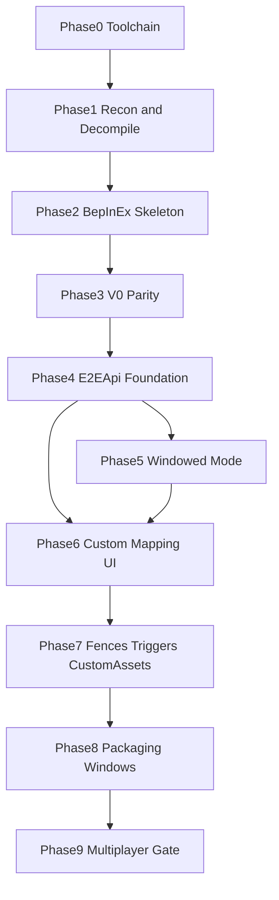

# The Steps — E2E Map Editor Rebuild

Roadmap for rebuilding the Escapists 2 map editor mod from scratch, with a proper
modding API (`E2EApi.dll`). Derived from [the big big plan.md](the%20big%20big%20plan.md)
and the recovered resources in [old/](old/INVENTORY.md).

## Confirmed decisions

- **Loader/platform:** BepInEx 5 on the native Linux build
  (`~/.local/share/Steam/steamapps/common/The Escapists 2`, Unity 5.5.0p4, Mono).
  Same package ships for Windows.
- **Decompilation goal:** readable C# reference + asset dump. Not a runnable Unity
  project. Publicized assemblies for compiling against private members.
- **Multiplayer:** single-player first. Later: "this map requires the mod" gate.
- **API:** separate `E2EApi.dll`; the map editor mod is its first consumer.
  Mod code touches the game **only** through the API. Missing API feature →
  add it to the API, then continue the mod (the step-1000-along-the-way rule).

## Repo layout

```
e2e mapeditor/
├── src/
│   ├── E2EApi/           # the modding API (separate DLL)
│   └── MapEditorMod/     # the map editor mod (consumes E2EApi)
├── tools/                # level.dat parser, build scripts
├── docs/                 # game-architecture.md, api docs, user guide
├── reference/            # decompiled game source + asset dump (gitignored)
├── old/                  # recovered artifacts of previous attempts (read-only)
├── the big big plan.md   # the vision
└── the steps.md          # this file
```

---

## Phase 0 — Toolchain and repo layout

**Goal:** every tool needed for the rest of the project works on this machine.

- [x] Install .NET SDK and `ilspycmd` (decompiler CLI)
- [x] Install AssetRipper (Linux build) for asset extraction
- [x] Create repo layout: `src/E2EApi`, `src/MapEditorMod`, `tools`, `docs`, `reference`
- [x] Init git repo with `.gitignore` (reference/, build output, game DLLs)

**Done when:** `ilspycmd --version` and AssetRipper run; folder skeleton exists.

---

## Phase 1 — Recon: V0 mod + game decompilation (big-plan steps 0 and 0.5)

**Goal:** know exactly what the old mod did and how the game works inside.

- [x] Decompile `old/00-legacy-bepinex-v0/MapEditor.dll` → `reference/v0-mod/`
- [x] Write `docs/v0-features.md` — every feature of V0 = **the minimum feature bar**
- [x] Decompile fresh `Assembly-CSharp.dll` + `Assembly-CSharp-firstpass.dll`
      from the live install → `reference/decompiled/`
- [x] Cross-check against the 2024 dnSpy dump in `old/04-escapists-map-edit-mod/`
      (look for diffs = game updates since then)
- [x] AssetRipper dump of editor-relevant assets → `reference/assets/`
      (block icons `m_UIImage`, `leveleditor/textures/*`, prefabs)
- [x] Write `docs/game-architecture.md` covering:
  - `EditorLevelEditorManager` / `BaseLevelManager` (place/remove tile, wall, object)
  - `BuildingBlockManager` + `BaseBuildingBlock` (spawnlist, footprints, `m_EditorOnly`,
    `m_FirstVersionAllowed`/`m_LastVersionAllowed`)
  - `LevelEditor_ZoneManager` (zones)
  - `LevelDetailsManager` (editor data versions)
  - `Gamer` / player object / `CharacterStats`
  - `T17EventSystem` ("LevelEditor" input map)
  - save/load flow for custom maps
- [x] Reverse the `Level.dat` format (gzip container; samples in
      `old/06-game-saves/Saves/76561198429631328/ESC2U*/`) → `docs/leveldat-format.md`
- [x] Build `tools/leveldat/` — parser + dumper for `Level.dat`

**Done when:** game architecture doc exists, `Level.dat` can be parsed to readable
output, V0 feature list is written.

---

## Phase 2 — Mod skeleton (BepInEx + build infra)

**Goal:** a hello-world plugin loads in the running game on Linux.

- [x] Install BepInEx 5 (x64 linux) into the game directory
      (5.4.21; see `docs/dev-setup.md` for the required LD_LIBRARY_PATH fix)
- [x] Wire `run_bepinex.sh` into Steam launch options
      (`./run_bepinex.sh %command%`)
- [x] `src/Directory.Build.props` with `GamePath` property → game `Managed/` refs
- [x] Publicize `Assembly-CSharp.dll` (BepInEx.AssemblyPublicizer) → private members
      accessible at compile time
- [x] `src/MapEditorMod/` net35 csproj; hello-world `BaseUnityPlugin` that logs
      and applies one Harmony patch
- [x] One-command build+deploy script (`tools/build.sh`) that copies DLLs into
      `BepInEx/plugins/`
- [x] Verify in-game: log line appears in BepInEx console/log

**Done when:** `tools/build.sh && launch game` shows the plugin loaded and patching.

---

## Phase 3 — V0 feature parity (big-plan step 0 goal)

**Goal:** everything V0 could do, the new mod can do — through first API primitives.

- [x] Implement each feature from `docs/v0-features.md` (list filled in Phase 1)
- [x] Salvage useful experiments from `old/01-melonloader-mod-vs-backups/`:
  - custom `BaseBuildingBlock` injection (`buttons.cs`) → `Blocks.Register`
  - heal / stealth helpers (zero heat, knock out guards/dogs)
    → `Player.Heal/ClearSuspicion`, `Cheats.KnockOutGuards/Dogs`
  - the block-template notes in `Class1.cs`
- [x] Each feature lands as: API call in `E2EApi` + thin consumer in `MapEditorMod`

**Done when:** every V0 feature works in-game via the new mod.

---

## Phase 4 — E2EApi foundation (big-plan step 1000, built along the way)

**Goal:** the API surface other modders (and we) build against.

- [x] `E2EApi.Players` — `Player.GetLocal()`, `GetAll()`, `.Heal()`, `.Heat`,
      `.TeleportToTile()`, `.ClearSuspicion()` … (no noclip — never needed)
- [x] `E2EApi.Items` — item registry wrapper (`GetData`, `Allowed`, `KeyItems`,
      `Give` via the game's assignment RPC)
- [x] `E2EApi.Editor` — blocks, zones, placement
      (`Placement.PlaceBlock/PlaceArea/AddToZone`, `Blocks.All/GetSpawnList`)
- [x] `E2EApi.Events` — game lifecycle events (level loaded, editor entered/exited)
- [x] `E2EApi.UI` — window/tab toolkit (used by our own UI in Phase 6)
- [x] Central Harmony patch registry → conflict safety, one place to see all patches
- [x] Versioned API (`E2EApiInfo.Version`), semver from day one

**Done when:** `MapEditorMod` contains no direct game-type references — only E2EApi.

---

## Phase 5 — Windowed mode (big-plan change 1)

**Goal:** game launches windowed when the mod is active; editor UI can float.

- [x] Config option `ForceWindowed` (default on) → `Screen.SetResolution(w, h, false)`
      on startup + `-screen-fullscreen 0` documented for launch options
- [x] Stage 1: movable/resizable in-game uGUI window (Unity 5.5 cannot spawn a
      second OS window)
- [x] Stage 2 (stretch, Phase 9): external companion window via separate process + IPC
      — fulfilled by the web UI: a real browser window talking HTTP to the mod

**Done when:** game starts windowed with the mod; a draggable empty mod window renders.

---

## Phase 6 — Custom mapping UI (big-plan changes 2 + 3)

**Goal:** our own tabbed editor window with full vanilla spawnlist parity.

- [x] Tabbed window via `E2EApi.UI`: tab 1 = mod settings, tab 2 = mapping UI
      (plus the browser UI at `http://127.0.0.1:8723` with the same tabs)
- [x] Window only visible inside the level editor (`E2EApi.Events` editor enter/exit)
- [x] Enumerate `BuildingBlockManager` → all blocks with icons (`m_UIImage`,
      TEMP-placeholder icons re-rendered live from prefabs), categories, search
- [x] Full placement parity through the API: tiles, walls, objects, zones,
      undo where the game supports it (`Placement` routes through the game's
      instruction log)
- [x] Selection/inspection: hover tooltips + X-ray mode show every placed
      block's researched properties (incl. invisible/dev blocks)

**Done when:** a map can be built start-to-finish using only our UI.

---

## Phase 7 — The features everybody wants (big-plan change 4)

**Goal:** dev-level editor power.

- [x] Unlock dev-only blocks (`m_EditorOnly = true`) in our spawnlist
- [x] Unlock DLC map asset families + version-gated blocks — the mod's own
      spawnlist ignores theme/family filters entirely; the version fields
      (`m_FirstVersionAllowed`/`m_LastVersionAllowed`) turned out to be dead
      in this game build (serialized but never read by any code)
- [x] Electric fences (tile marking + overlay + runtime damage behaviour)
- [x] Buttons/triggers linking system:
  - button = any tile chosen as a link source (no new placeable needed)
  - link editor in our UI (click source → click target; F7 or the web UI
    link tool; arrows visualize links)
  - runtime: E on a button tile fires its links — action set is currently
    fence toggle only (doors etc. = future actions)
- [x] Custom assets in maps via AssetBundles (Unity 5.5-compatible build
      pipeline) — `CustomAssetPlacements` tracks placed prefabs per tile,
      persists them in the sidecar `[custom_assets]` section, spawns/destroys
      instances with editor lifecycle. Web API (`/api/custom-assets/*`) and
      a Tools-tab UI card let you pick a bundle+asset and place at the cursor.
      Unity 5.5 bundle build: see `docs/bundle-build-pipeline.md`.
- [x] Persistence: mod-extras sidecar next to `Level.dat`
      (`Level.e2e` text format) + "requires mod" flag
- [x] Maps without mod-extras stay 100% vanilla-compatible (sidecar is
      deleted when empty; vanilla never reads it)

**Done when:** a map with fences + triggers + a custom asset saves, loads, and plays.

---

## Phase 7.5 — Custom tilesets, Workshop carry, vanilla fallback

**Goal:** paint any game art (incl. DLC scene art) onto custom maps; such maps
upload to Workshop and degrade gracefully for vanilla players.
Details: `docs/custom-tilesets.md`.

- [x] `TileSets` harvester: additive scene loads from the main menu scrape
      every texture/sprite of all 17 base+DLC prison/transport scenes into a
      PNG atlas cache (1033 atlases on this machine)
- [x] `ModTiles` + `ModTileOverlay`: stamp placements (atlas name + pixel
      rect, multi-tile capable, floor/decor depth), editor layer view,
      play-mode rendering, magenta placeholders for missing atlases
- [x] Web UI Tilesets tab: harvest, atlas browser, 32-px region picker,
      paint/erase tools wired to `EditorTools`
- [x] Sidecar `[tiles]` section; sidecar now also loads on editor entry
      (`GameEvents.EditorEntered` + `GlobalStart.m_strCustomLevelFile`;
      `SaveManager.LoadTheLevel` is dead code in this build)
- [x] Workshop: `SteamPlatform.UploadUGCItem` prefix stages `Level.e2e`;
      download side picked up via `GetCustomLevelFilePath` postfix
      (real publish round-trip still unverified — needs interactive Steam)
- [x] Vanilla fallback (config `Tilesets.VanillaFallbackMap`, default on):
      finished saves stash the real map in the sidecar `[realmap]` and write
      a disclaimer `Level_Finished.dat` ("NEEDS E2E MAPEDITOR MOD" painted in
      floor tiles); modded clients auto-swap the real map back in at load
- [x] Editor/playtest lifecycle: fixed dead `EditorExited` event
      (`EditorLevelEditorManager.OnDestroy` never calls base) — all mod
      editor artifacts tear down for playtest and return after
- [x] Loading overlay: blocking progress bar during harvest and per-map
      atlas preload
- [x] Web UI Blocks tab: 14 metadata filter chips + saved custom filters,
      drag-and-drop arrangement, two-way selected-block highlight; prefs
      persist in `BepInEx/config/e2e_webui_prefs.json` (`/api/prefs`)

**Done when:** a map painted with DLC tiles saves/loads/playtests, the
finished save carries the fallback, and the web UI browses all harvested sets.

---

## Phase 7.6 — Virtual map layers (multi-floor geometry)

**Goal:** maps can define more than 6 virtual layers sharing the game's 6
physical floors, with per-character floor state tracked and exposed over the
web API so scripts can navigate by virtual layer index.

- [x] `MapGeometry` core: virtual layer list (`VirtualLayer`: id, name, type,
      backingLayer, hidden), sidecar `[geometry]` section, `SelectLayer`,
      `GetBackingLayer`, `ToJson`, `Apply`
- [x] `FloorTypeRegistry`: runtime physical→virtualType mapping; rebuilt from
      `MapGeometry.Apply()` and loaded from `[floor_type_map]` sidecar section
- [x] `VirtualFloorState`: per-character virtual layer index stored in a
      `ConditionalWeakTable`; `Set`/`TryGet` API
- [x] Floor predicate patches: `IsVent`, `IsUnderground`, `IsGround`, `IsRoof`
      use `FloorTypeRegistry` wrappers so custom types win over native enum
- [x] Navigation patches: `FloorManager.UpAFloor`/`DownAFloor`,
      `Character.CanAccessVent`, stair/ladder direction comparisons patched to
      respect the virtual ordering
- [x] Z-lookup patches: `Grid.TileToWorld` z-depth disambiguates shared-backing
      virtual layers using `VirtualFloorState`
- [x] `CharacterFloorPatch`: postfix patches write `VirtualFloorState` whenever
      `Player.Teleport` or `Character.set_CurrentFloor`/`SetFloor` runs
- [x] `Player.GetTile` virtual layer overload; `Player.TeleportToTile` virtual
      layer overload (resolves backing layer, writes state on success)
- [x] Web API: `GET /api/layers` alias, `POST /api/layers/select`,
      `GET /api/map/v/{vi}.png`, updated `/api/player` (adds `virtualLayer`),
      updated `POST /api/teleport` (accepts `virtualLayer`),
      `GET /api/debug/floor-registry`, `GET /api/debug/virtual-floors`
- [x] Web UI: `curVirtualLayer` state, virtual layer buttons in gameplay tab
      (`pickVirtualLayer`), player stats show `vLayer`, `mapClick` sends
      `virtualLayer` when active

**Done when:** a map with shared-backing virtual layers lets the player
navigate between them via the web UI, teleport to a tile on a specific virtual
layer, and show the correct Z-depth in-game.

---

## Phase 8 — Packaging and Windows validation

**Goal:** anyone can install and use the mod; modders can use the API.

- [ ] Test identical BepInEx package on Windows (game install / Proton-free)
      — cannot be done on this Linux box; needs a Windows machine
- [x] Release zip layout: `BepInEx/plugins/E2EMapEditor/E2EApi.dll +
      MapEditorMod.dll` (`tools/release.sh` → `dist/E2EMapEditor-v<ver>.zip`)
- [x] `docs/user-install.md` — Windows + Linux install guide
- [x] `docs/api.md` — modder-facing API documentation (full E2EApi surface +
      the web API endpoints)
- [ ] GitHub release / ModDB page — pending the Windows validation above

**Done when:** a clean Windows machine can install from the release zip and edit a map.

---

## Phase 9 — Later / stretch

- [ ] Multiplayer gate: "you need this mod to play this map"
      (handshake via Photon custom properties)
- [ ] Steam Workshop interplay for modded maps
- [ ] External editor window as companion process (IPC)

---

## Dependency overview



## Key reference material in old/

| Resource | Use |
|----------|-----|
| `old/00-legacy-bepinex-v0/MapEditor.dll` | V0 feature bar (Phase 1) |
| `old/01-melonloader-mod-vs-backups/` | Custom block injection + player helpers (Phase 3) |
| `old/04-escapists-map-edit-mod/` | 2024 decompile for diffing (Phase 1) |
| `old/06-game-saves/.../ESC2U*/Level.dat` | Save format samples (Phase 1, 7) |
| `old/09-unity-decompiled-e2/` | Asset dump incl. LevelEditor scenes (Phase 6, 7) |
| `old/03-html-map-editor/` | UX ideas for export/settings (Phase 6) |
| `old/INVENTORY.md` | Full catalog of everything recovered |
